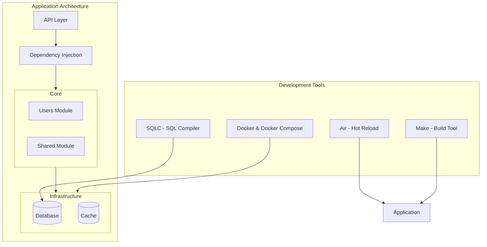

# Hear! Backend

Backend for the Hear! app using Golang and Fiber.

## Architecture



## Development Tools

- Air - Hot reloading during development
- SQLC - Type-safe SQL queries
- Docker & Docker Compose - Containerization
- Make - Build automation
- Go - Main programming language
- PostgreSQL - Database
- Fiber - Web framework

## Development

```bash
air
```

## Make commands

```bash
# Build the project
make build

# Run the project
make run
```
